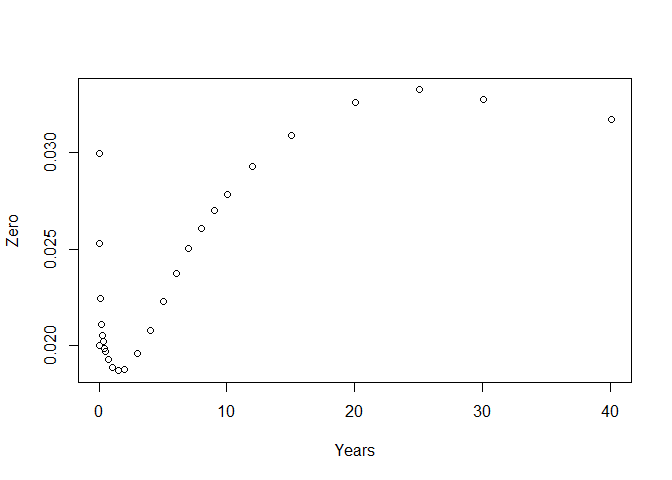

<!-- README.md is generated from README.Rmd. Please edit that file -->
fmbasics - Financial Market Building Blocks
===========================================

[](https://cran.r-project.org/package=fmbasics) [](https://travis-ci.org/imanuelcostigan/fmbasics) [](https://ci.appveyor.com/project/imanuelcostigan/fmbasics) [](https://codecov.io/github/imanuelcostigan/fmbasics?branch=master)

Implements basic financial market objects like currencies, currency pairs, interest rates and interest rate indices. You will be able to use Benchmark instances of these objects which have been defined using their most common conventions or those defined by International Swap Dealer Association (ISDA, <http://www2.isda.org>) legal documentation.

You can create instances of key currencies and currency pairs (and of course create your own implementations):

``` r
library("fmbasics")
AUD()
#> <Currency> AUD
AUDUSD()
#> <CurrencyPair> AUDUSD
```

These come with implementations of handy methods:

``` r
library("lubridate")
to_fx_value(dates = Sys.Date(), tenor = "spot", x = AUDUSD())
#> [1] "2017-05-02"
to_fx_value(Sys.Date(), months(3), AUDUSD())
#> [1] "2017-08-02"
```

You can create instances of key IBOR or ONIA interest rate indices:

``` r
USDLIBOR(months(3))
#> <IborIndex> 3m USD USDLIBOR
EONIA()
#> <CashIndex> EONIA
```

These also come with implementations of handy methods:

``` r
to_reset(dates = as.Date("2017-01-20"), index = USDLIBOR(months(3)))
#> [1] "2017-01-18"
to_value(as.Date("2017-01-20"), USDLIBOR(months(3)))
#> [1] "2017-01-24"
to_maturity(as.Date("2017-01-20"), USDLIBOR(months(3)))
#> [1] "2017-04-20"
```

You can create and perform basic manipulation of interest rates and discount factors:

``` r
rr <- InterestRate(value = 0.01, compounding = Inf, day_basis = "act/365")
as_DiscountFactor(rr, d1 = ymd(20170120), d2 = ymd(20210120))
#> <DiscountFactor> 0.960763116514576, 2017-01-20--2021-01-20
# Convert to different rate basis
as_InterestRate(rr, day_basis = "act/360")
#> <InterestRate> 0.9863014%, CONTINUOUS, ACT/360
as_InterestRate(rr, compounding = 2, day_basis = "act/360")
#> <InterestRate> 0.9887373%, SEMI-ANNUAL, ACT/360
dd <- DiscountFactor(0.75, d1 = ymd(20170120), d2 = ymd(20210120))
as_InterestRate(dd, compounding = Inf, day_basis = "act/360")
#> <InterestRate> 7.088675%, CONTINUOUS, ACT/360
```

It is also possible to create and interpolate on zero coupon interest rate curves:

``` r
zc_df <- fmdata_example("zerocurve.csv")
values <- zc_df$dfs
starts <- as.Date(as.character(zc_df[["start"]]), "%Y%m%d")
ends <- as.Date(as.character(zc_df[["end"]]), "%Y%m%d")
dfs <- DiscountFactor(values, starts, ends)
zc <- ZeroCurve(dfs, starts[1], LogDFInterpolation())
plot(zc$pillar_times, zc$pillar_zeros, xlab = 'Years', ylab = 'Zero')
```



``` r
interpolate(zc, 1:20)
#>  [1] 0.01886025 0.01875951 0.01957137 0.02077059 0.02226385 0.02370676
#>  [7] 0.02500574 0.02602505 0.02696769 0.02783101 0.02862813 0.02929467
#> [13] 0.02990451 0.03042819 0.03088204 0.03131674 0.03170140 0.03204332
#> [19] 0.03234925 0.03262458
```

Further details can be found in this package's help pages and vignettes (`vignette(package = "fmbasics")`)
